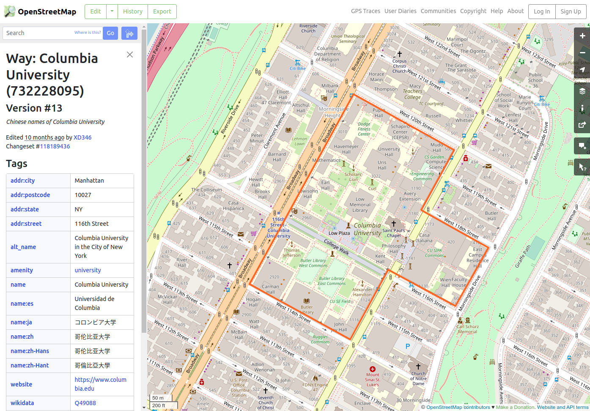
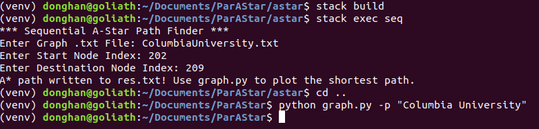
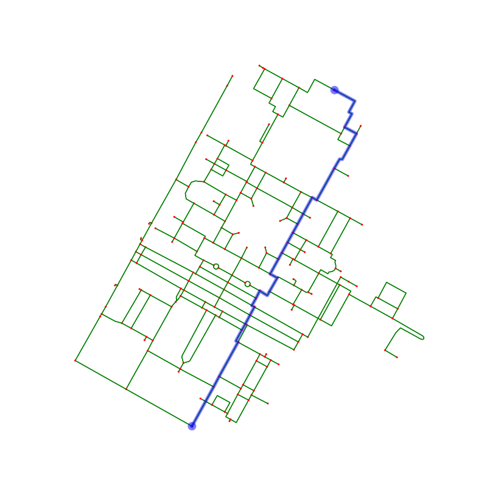

# Parallel A* Search
A* (A-Star) search is a path-finding algorithm that utilizes a heuristic function to find the target location (node) faster than traditional shortest path-finding algorithms such as Dijkstra’s algorithm. This project generates, calculates, and plots the shortest path between two nodes in a weighted, bi-directional graph obtained from OpenStreetMaps (OSM) open-source database.

## Local Installation Dependencies
This project requires Python3, with virtualenv for pip package management, and the Haskell tool stack managed by GHCup.

* Python3
* GHCup (GHC 9.2.5)
* Stack resolver (lts-19.23)

## Project Structure
The graph.py python script helps extract graph data from OSM and plots the shortest path obtained from the Haskell executable. All Haskell-related code is contained in the astar folder. 
```bash
.
├── astar
│   ├── astar.cabal
│   ├── CHANGELOG.md
│   ├── data
│   ├── package.yaml
│   ├── parApp
│   │   └── Main.hs
│   ├── seqApp
│   │   └── Main.hs
│   ├── Setup.hs
│   ├── src
│   │   └── Lib.hs
│   ├── stack.yaml
│   ├── stack.yaml.lock
│   └── test
│       └── Spec.hs
├── demo_seq.sh
├── graph.py
├── LICENSE
├── README.md
└── requirements.txt
```

## OSM Data Extraction
To run the graph.py script, you will need to install all the pip dependencies, using either conda or virtualenv. The following instructions help you install all the dependencies using virtualenv.
```bash
git clone git@github.com:donghankim/ParAStar.git
cd ParAStar

# create python vevn & install dependencies
python3 -m virtualenv venv
pip3 install -r requirements.txt

# activate venv
source venv/bin/activate

# install "Columbia University" graph data
python graph.py -g "Columbia University"
```
The OSM data will be installed in <strong>astar/data</strong> folder. The .txt file is used by the Haskell application to run A* search, whilst the .pickle and .graphml files are used for plotting the shortest path.

All nodes have an OSM id that is required to plot a given path. However, because the id's are complicated, each node is given an arbitrary index that starts from 0. This arbitrary index is mapped to the OSM id using a hashmap stored in the .pickle file. You can refer to the [OSM website](https://www.openstreetmap.org/) to find a certain place/location that you want to download and run A* search on.

<p align="center">
  
</p>

## Haskell Sequential and Parallel A* Search

Two Haskell executables are created upon running <strong>stack build</strong>: seq and par. The “seq” executable runs A* search sequentially, whereas the “par” executable runs A* search in parallel. Both executables will first ask for the graph .txt file generated from the python graph.py script. You don't have to specify the directory name or path, only the .txt file name. Both executables will only look inside the astar/data directory. The start and destination nodes can be selected by observing the .png file generated (also in the astar/data folder). Please keep in mind for larger graphs, it may be difficult to look at the node indexes without zooming in. The calculated shortest path is outputted into a file called “res.txt” within the astar directory. Please note this file is overwritten every time A* search is executed (for both seq and par executable).
```bash
cd astar/

# build Haskell executables using stack
stack build

# run sequentiual A* executable
stack exec seq

# run parallel A* executable
stack exec par
```
<p align="center">
  
</p>

## Plotting Shortest Path
To plot the shortest path, simply use the graph.py Python script and specify the graph name. This is simply the location name you entered to generate the graph data in the OSM data extraction section. The pyhton script will automatically look for the <strong>res.txt</strong> file in the astar folder and plot the path accordingly. The example below shows the shortest path between node 202 and 209 in the Columbia University graph. 
```bash
cd ParAStar
python graph.py -p "Columbia University"
```
<p align="center">
  
  
</p>

## Resources
OpenStreetMap:
https://www.openstreetmap.org/search?whereami=1&query=40.80863%2C-73.96156#map=18/40.80863/-73.96156

OSMnx:
https://github.com/gboeing/osmnx

Faster file processing with bystestring and regex:
https://book.realworldhaskell.org/read/efficient-file-processing-regular-expressions-and-file-name-matching.html

Parallel computation review (Haskell):
https://www.oreilly.com/library/view/parallel-and-concurrent/9781449335939/ch02.html

Vincenty Formula:
https://nathanrooy.github.io/posts/2016-12-18/vincenty-formula-with-python/

GHCi Debug (Haskell):
https://downloads.haskell.org/~ghc/8.6.5/docs/html/users_guide/ghci.html#the-ghci-debugger
